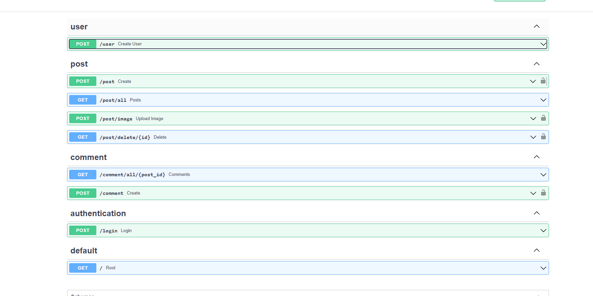

Création de la database : database.py
Création de l'user : db_user.py
Encodade du mot de passe : hashing.py
Création, affichage, suppression des posts : db_post.py
Création et affichage des commentaires : db_comment.py
Authentification : authentification.py et oauth2.py
routers : comment.py , post.py , user.py
Cors : main.py


### Database
````python
from sqlalchemy import create_engine
from sqlalchemy.ext.declarative import declarative_base
from sqlalchemy.orm import sessionmaker

SQLALCHEMY_DATABASE_URL = 'sqlite:///./database1.db'

engine = create_engine(SQLALCHEMY_DATABASE_URL, connect_args={"check_same_thread": False})

SessionLocal = sessionmaker(bind=engine, autocommit=False, autoflush=False)

Base = declarative_base()


def get_db():
    db = SessionLocal()
    try:
        yield db
    finally:
        db.close()
````

### Model
````python
from sqlalchemy.sql.schema import ForeignKey
from .database import Base
from sqlalchemy import Column, Integer, String, DateTime
from sqlalchemy.orm import relationship

class DbUser(Base):
  __tablename__ = 'user'
  id = Column(Integer, primary_key=True, index=True)
  username = Column(String)
  email = Column(String)
  password = Column(String)
  items = relationship('DbPost', back_populates='user')

class DbPost(Base):
  __tablename__ = 'post'
  id = Column(Integer, primary_key=True, index=True)
  image_url = Column(String)
  image_url_type = Column(String)
  caption = Column(String)
  timestamp = Column(DateTime)
  user_id = Column(Integer, ForeignKey('user.id'))
  user = relationship('DbUser', back_populates='items')
  comments = relationship('DbComment', back_populates='post')

class DbComment(Base):
  __tablename__ = 'comment'
  id = Column(Integer, primary_key=True, index=True)
  text = Column(String)
  username = Column(String)
  timestamp = Column(DateTime)
  post_id = Column(Integer, ForeignKey('post.id'))
  post = relationship("DbPost", back_populates="comments")

````
schemas.py:
````python
from pydantic import BaseModel
from datetime import datetime
from typing import List


class UserBase(BaseModel):
  username: str
  email: str
  password: str

class UserDisplay(BaseModel):
  username: str
  email: str
  class Config():
    orm_mode = True

class PostBase(BaseModel):
  image_url: str
  image_url_type: str
  caption: str
  creator_id: int

# For PostDisplay
class User(BaseModel):
  username: str
  class Config():
    orm_mode = True

# For PostDisplay
class Comment(BaseModel):
  text: str
  username: str
  timestamp: datetime
  class Config():
    orm_mode = True

class PostDisplay(BaseModel):
  id: int
  image_url: str
  image_url_type: str
  caption: str
  timestamp: datetime
  user: User
  comments: List[Comment]
  class Config():
    orm_mode = True

class UserAuth(BaseModel):
  id: int
  username: str
  email: str

class CommentBase(BaseModel):
  username: str
  text: str
  post_id: int
````

